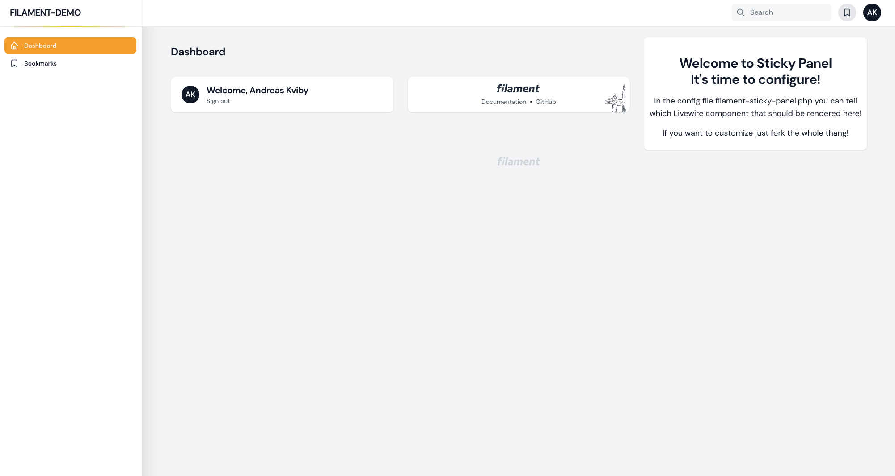
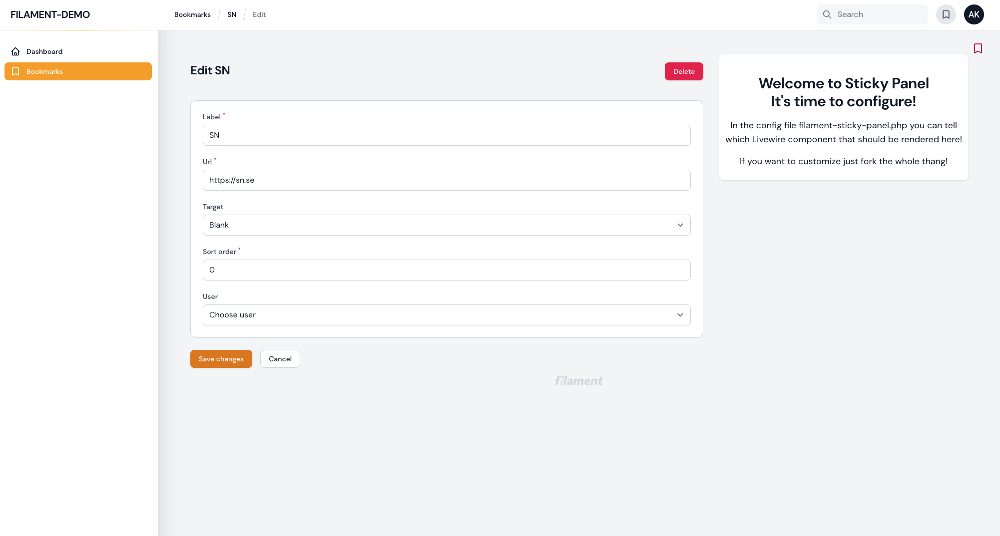

# Filament Sticky Panel for Filament Admin

[](https://packagist.org/packages/stafe-group-ab/filament-sticky-panel)
[](https://packagist.org/packages/stafe-group-ab/filament-sticky-panel)





This Filament Plugin will give you a right sidepanel in your Filament Admin in which you can render
any Livewire component that you create. You can configure in the config file which component to render
on which page in your Filament Admin.

## Installation

You can install the package via composer:

```bash
composer require stafe-group-ab/filament-sticky-panel
```

You can publish the config file with:

```bash
php artisan vendor:publish --tag="filament-sticky-panel-config"
```

This is the contents of the published config file. Use the basenames or page_urls here.

```php
return [
    'pages' => [
        'admin' => [
            'page_url' => 'admin',
            'component' => '', //'demo-component',
        ],
        'edit' => [
            'page_url' => 'edit',
            'component' => '', //'edit-helper-component',
        ],
    ],
];
```

Optionally, you can publish the views using

```bash
php artisan vendor:publish --tag="filament-sticky-panel-views"
```

## Usage
Just install the plugin and add some pages in the config file. It will split up your page in two parts.
If you want to edit the grid settings, just public the views and do so.

## Testing

```bash
composer test
```

## Changelog

Please see [CHANGELOG](CHANGELOG.md) for more information on what has changed recently.

## Contributing

Please see [CONTRIBUTING](CONTRIBUTING.md) for details.

## Security Vulnerabilities

Please review [our security policy](../../security/policy) on how to report security vulnerabilities.

## Credits

- [Andreas Kviby, Stafe Group](https://github.com/STAFE-GROUP-AB)
- [All Contributors](../../contributors)

## License

The MIT License (MIT). Please see [License File](LICENSE.md) for more information.
